# Reseau 

# Introduction 
### Qu'est ce qu'un reseau ? 
- Un ensemble d'entites(objets,personnes,machines,etc..) interconnectees les unes avec les autres. 
- exemple : reseau de transport , reseau telephonique , reseau de neurones...

### reseau informatique : 
- un ensemble d'ordinateurs reelies entre eux grace a des lignes physiques et echangeant des informations sous forme de donnees numeriques
### interets des reseaux informatique 
- communication
- partage de ressources 
- minimisation des couts 
- ... 

### les topologies 
- En bus : tous les ordinateurs sont relies par un cable coaxial(le bus) ett chaque ordinateur est connecte en serie sur le bus, on dit encore qu'il forme un noeud. 
- En etoile : tous les ordinateurs sontt relies a un concentrateur(hub)
- En anneau : les ordinateurs sontt situes sur une boucle 
- cablage en maille : chaque machine est reliee a toutes les autres par un cable 
- Question : quels sont les avantages et inc de chaque topologie ? 

### les types de reseaux 
- LAN(Local area network) : meme organisation dans une pretite aire geographique 
- MAN(Metropolitan area network) : interconnexion de plusieurs LAN geographiquement proches
- WAN : Wide area network , interconnexion de plusieurs LAN a travers de grandes distances geographiques 

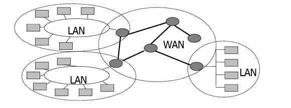

### Les techniques de transfert : 

- La commutation de circuits 
- le transfertt de paquets 

# Modeles en couches 

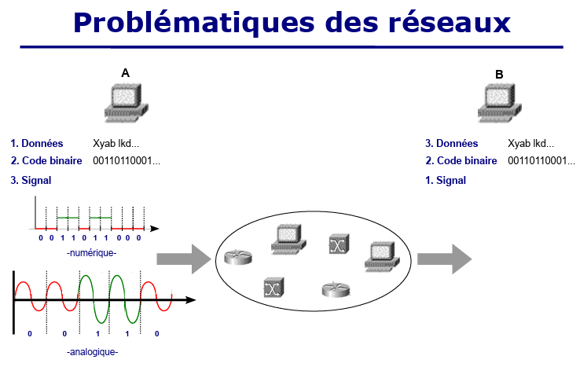
### protocole : 
- un ensemble de convention preetablies pour realise un echange de donnees entre deux entites 
- il definit le format des donnees et les regles d echanges : syntaxes et semantique de message ...
- En particulier 
1. format des donnees et les regles d'echange 
2. delimitation des blocs de donnees echanges
3. organisation et controle de l'echange
4. controle de la liaison 

## modele de reference OSI : 
- Open systems Interconnection (interconnexion des systemes ouverts)
- Definit par "international standard organisation"
    - organisation non gouvernementale
    - certaine de pays membres 
    - edite des normes dans tous les domaines 
### idee fondamentale : 
- modele en chouches
- une couche : un ensemble homogene destine a accomplir une tache ou rendre un service 
- le decoupage en couche permet de : 
    - dissocier des problemes de natures differentes 
    - rendre l'architecture evolutive 
    - faire de la reutilisation 
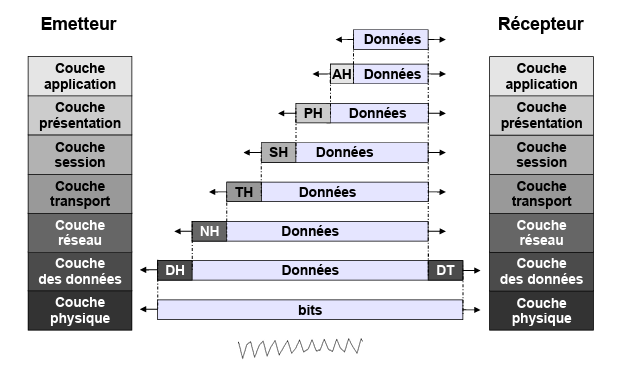
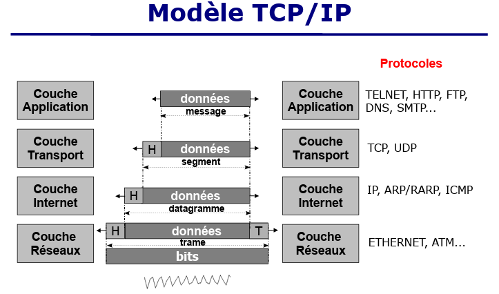
### les couches TCP/IP : 
- Reseau : 
    - acheminement des donnees sur la liaison 
    - coordination de la transmission de donnees(synchronisation)
    - conversion des signaux(analogique/numerique)
- Internet : communication entre machine 
    - adressage IP 
    - acheminement de datagrammes
    - peu de fonctionnalite, pas de garanties 
    - gestion de la fragmentation et assemblage 
    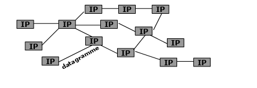
- Transport : communication entre applications 
    - Protocole de transport de bout en bout 
    - Present uniquement en extremites 
    - Transport fiable de segments(en mode connecte)
    - Protocole complexe(transmission,gestion des erreurs, sequencement ...)

- Application :
    - services de gestion(transfert) de fichier et d'impression 
    - services de connexion au reseau 
    - services de connexion a distance 
    - utilitaires internet divers 

### efficacite du transfert : 
- efficacite du transfert = donnees utiles/donnees totales 
### encapsulation :
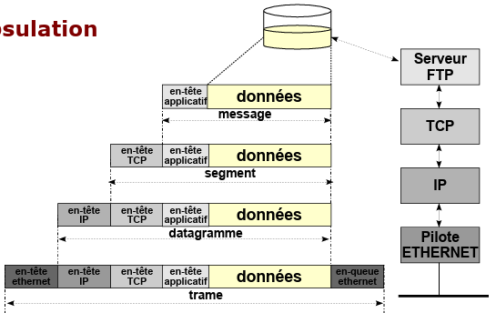
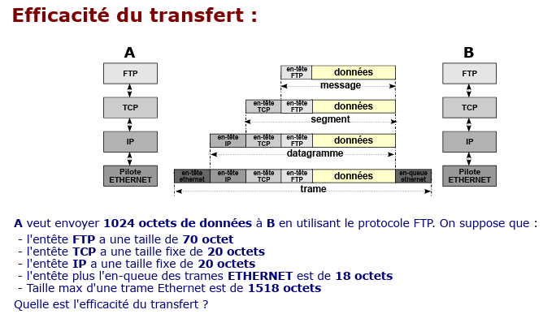

## delimitation des donnees : 
### notion de fanion : 
- lors d'une transmission de donnees, il faut pouvoir reperer le debut et la fin de la sequence des donnees transmises 
- fanion en transmission synchrone 
    - une caractere special 
    - une sequence de bits particuliers 
    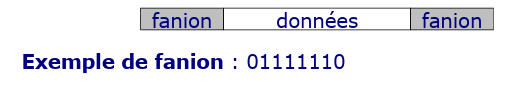
- fonctions du fanion 
    - delimite les donnees 
    - maintien de la synchronisation de l'horloge de reception 

- les caracteres "speciaux" comme le fanion ne sont pas delivres aux couches superieures,il sont interpretes pour les besoins du protocole 
- les caracteres "speciaux" doivent pouvoir etre transmis en tant que donnees et donc delivres en tant que tel : 
    - mecanisme de transparence
    - definition d'un autre caractere special ; le caractere d'echappement
- fonctionnement : 
    - cote emission : insertion du caractere d'echappement devant le caractere a proteger 
    - cote reception : l'automate examine chaque caractere pour decouvrir le fanion de fin ; s'il rencontre le caractere d'exhappement, il l'elimine et n'interprete pas le caractere suivant -> il le delivre au systeme 

 ### la technique du bit de bourrage 
 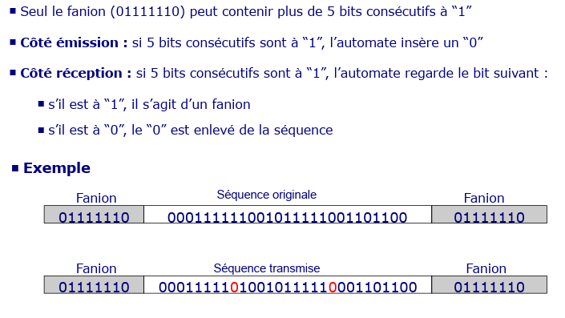

 # Couche Internet : 

 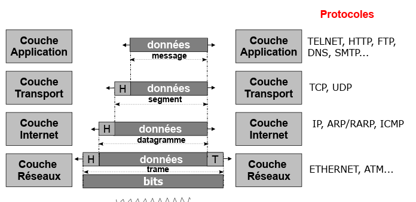
 - fontionalite : communication entre machines : 
    - adressage IP 
    - acheminement de datagrammes(en mode non connecte)
    - peu de fonctionnalite, pas de garanties
    - gestion de la fragmentation et assemblage 
- Protocoles de la couche 
    - IP - Internet Protocol 
    - ARP - Address resolution Protocol 
    - ICMP: internet control and error message protocol 
    - ... 

## adresse IP : 
- permet d'identifier les machines sur le reseau 
- distribuees par ICANN - internet corporation for assigned names and numbers 
    - adresse IP = 32 bits(4 octets)
    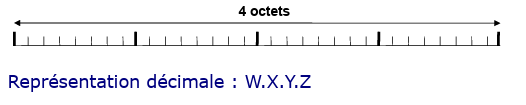
- chaque adresse est composee de deux champs : 
    - NET_ID = identifiant du reseau IP(utilise pour le routage)
    - HOST_ID: identifiant de la machine dans le reseau IP

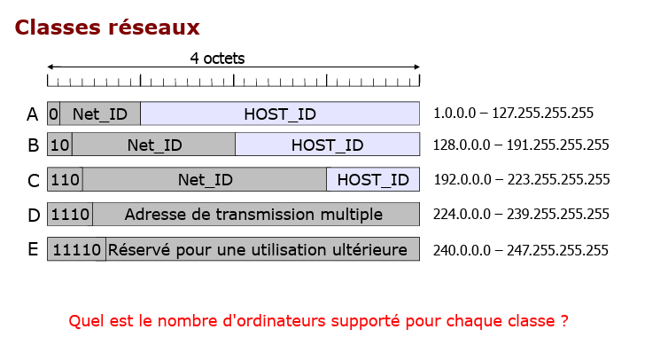
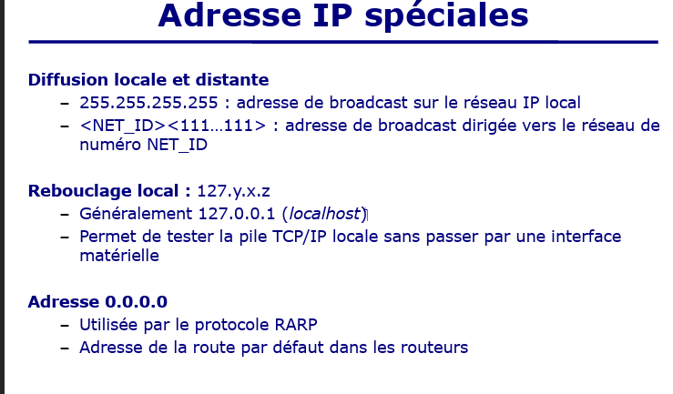

## sous-reseaux : 
- comment  diviser un reseau IP en plusieurs sous-reseaux ? 
- prendre quelques bits de la partie <host_id> de l'adresse IP pour le sous-reseau 
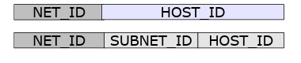
### utilisation des masques Netmask : 
- l'acheminement se fait en fonction de <NET_ID> et <SUBNET_ID> 
- Mais la taille de <SUBNET_ID> est inconnue ! 
- information donnee par le netmask ; tous les bits a 1 correspond a <NET_ID><SUBNET_ID>

- comment determiner l'adresse de sous-reseau ? 
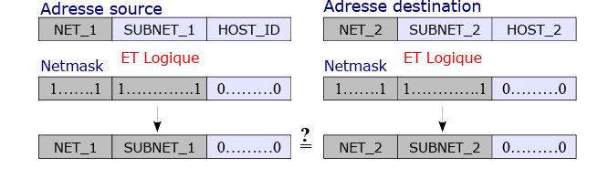
- le netmask permet de savoir si la machine source et destination sont sur le meme sous-reseau 
- la classe d'adressage permet de savoir si elles sont sur le meme reseau 

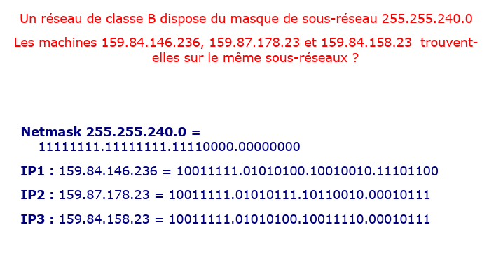
### format d'un diagramme IP : 
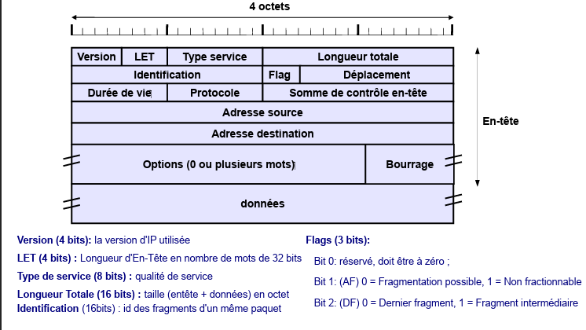
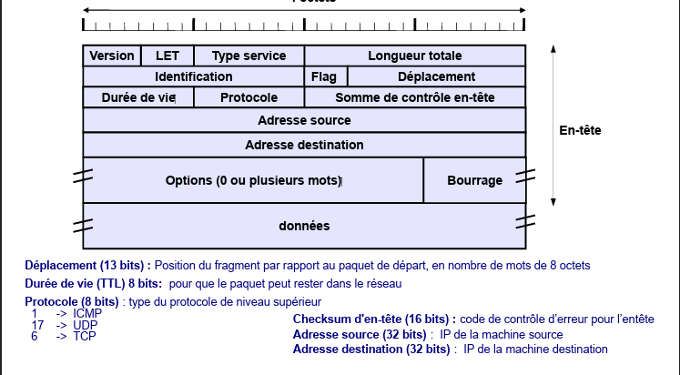
- quel est la taille maximale d'un datagramme ? 
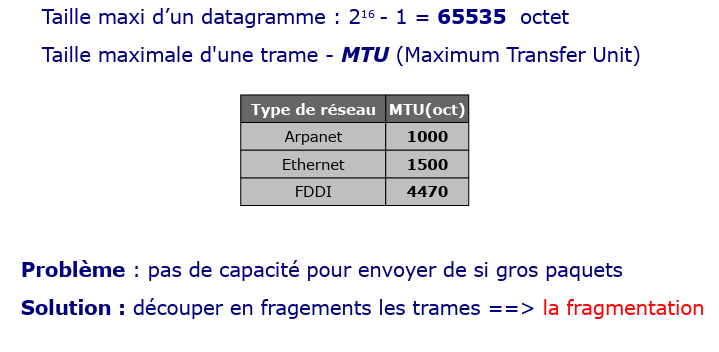
- se fait au niveau des routeuts 
- fonctionnement 
    - decouper en fragments de tailles inferieres au MTU du reseau et de telle facon que la taille du fragment soit un multiple de 8 octets 
    - ajouter des informations afin que la machine de destination  puisse reassembler les fragmetns dans le bon ordre 
    - envoyer ces fragments de maniere independante et les reencapluler de telle facon a tenir compte de la nouvelle taille du fragment 
    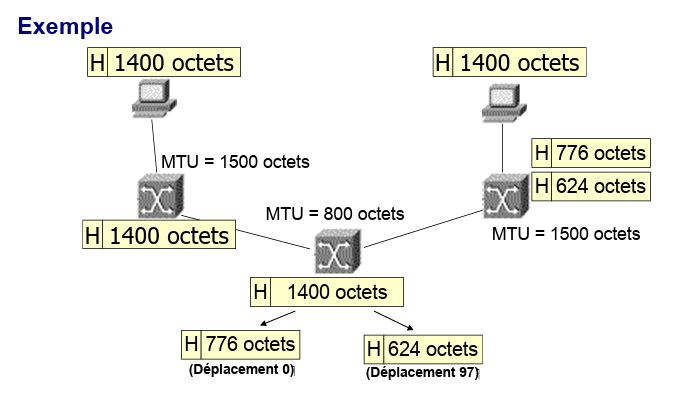
    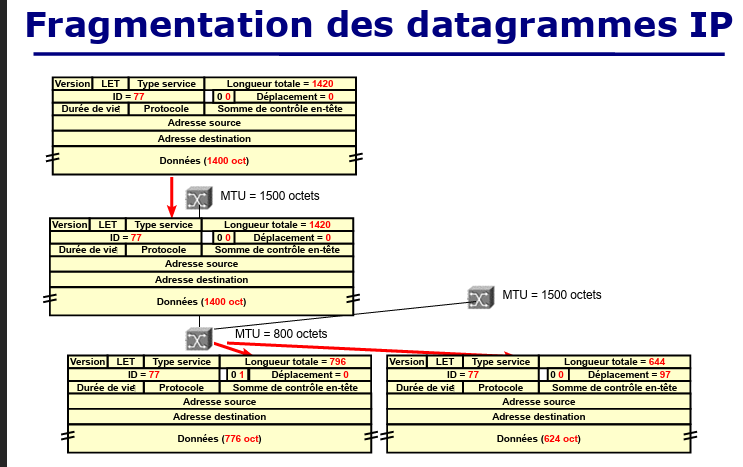
    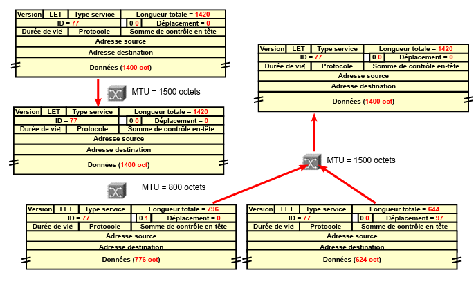

    ### Protocole ARP 
    - ARP(address resolution protocol) -- protocol de resolution d'adresse 
    - @MAC (adresse physique) : 48 bits , fixee par le fabriquant 
    - @IP(adresse logique): 32 bits , fixee par l'administrateur reseau ou ICANN
    - Role du protocole ARP : faire la correspondance entre un @IP et @MAC

    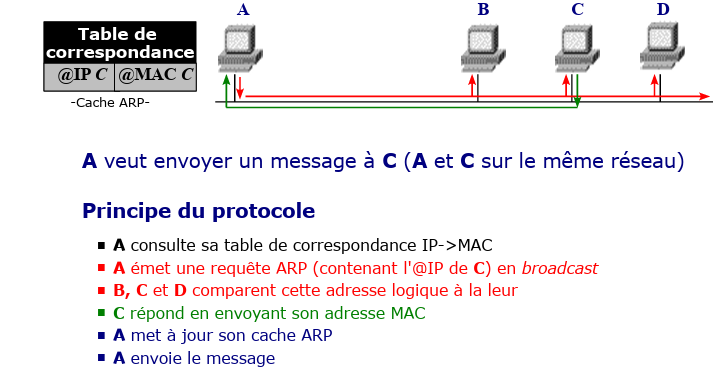 

## protocole ICMP 

- ICM : internet control and error message protocol 

- encaplsule dans un datagramme IP(champ protocole = 1)
- sert a controler le bon deroulement du protocole IP 
- utilise par l'utilitaire ping,tracecrout ..
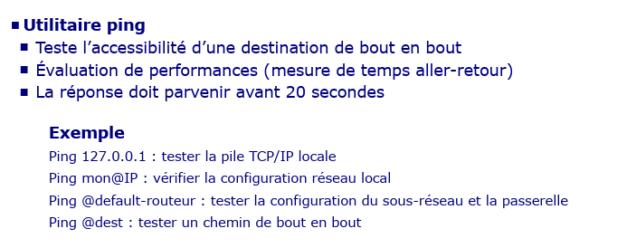
### utilitaire Traceroute/tracert 
- permet de trouver pas a pas le chemin pour atteindre une destination 
    - envoie d'un paquet IP avec TTL=1
    - attend ICMP delai expire
    - envoi d'un paquet IP avec TLL=2
    - ...
    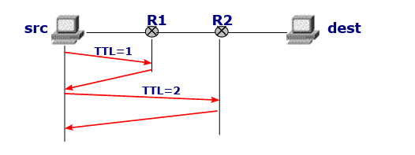

## protocole IPV6 
### pourquoi IPv6 
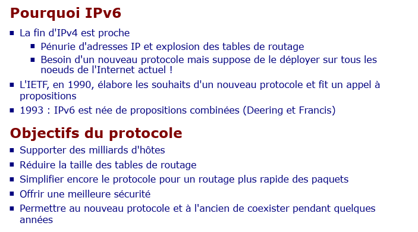
### caracteristiques : 
- IPv6 estt cpmpatible avec IPv4,TCP,UDP,ICMP,DNS ... (ou quelques modifications mineures) 
- supporte un format d'adresses plus longues(16 octers au lieu de 4)
- simplification de l'entere(7 champs au lieu de 13 et une taille fixe des options pour accelerer le traitement dans les routeurs)
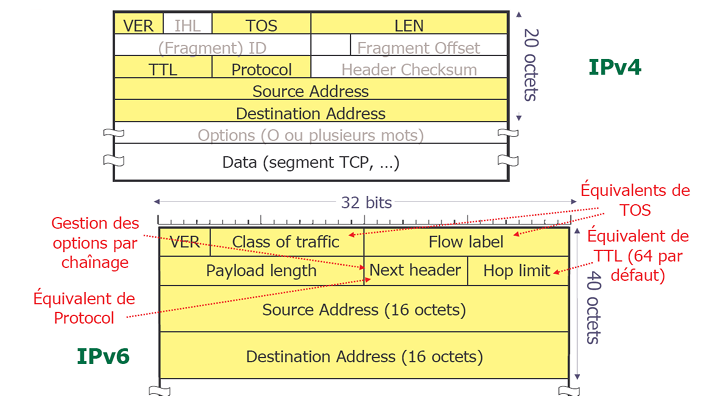
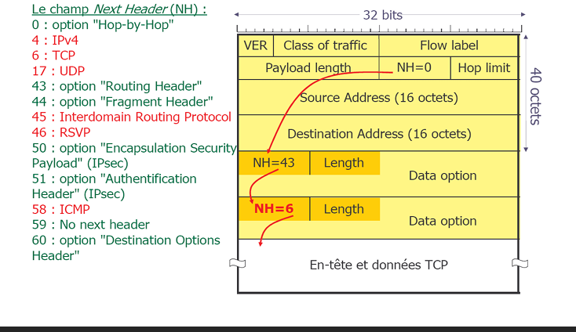
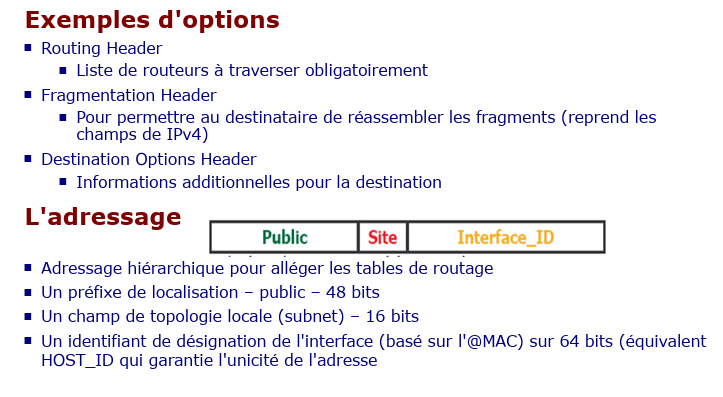

# Routage : 
- quel chemin emprutent les datagrammes pour arriver a destination ? 
- routage : mecanisme par lequel les donnees d'un equipement expediteur sont acheminees jusqu'a leur destinataire 
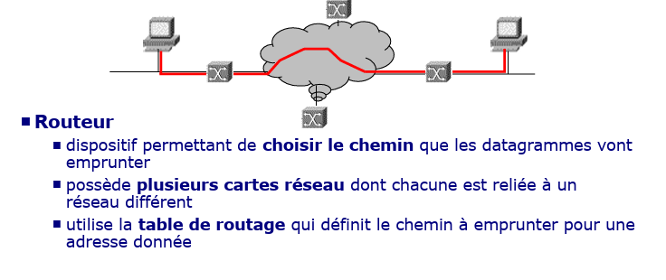
### table de routage : 
- definit la correspondance entre l'adresse de la machine visee et le noeud suivant auquel le routeur doit delivrer le message. 
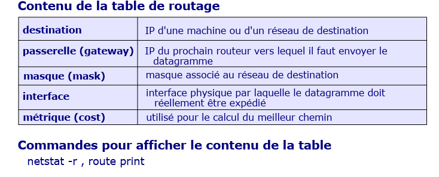

## Routage statique(commandes) :
- la commande route permet d'indiquer une route vers :
    - un reseau (NET_ID)
    - une machine (HOST_ID)
    - ou une adresse par defaut(default)

- syntexte : 
    -  route add | del [net |  host] destination | netmask | gw | metric

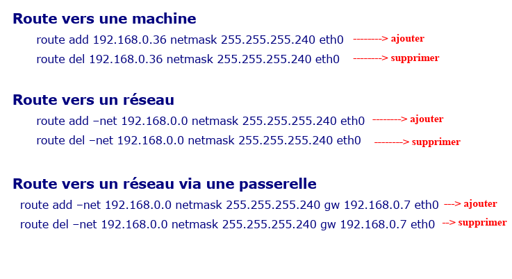
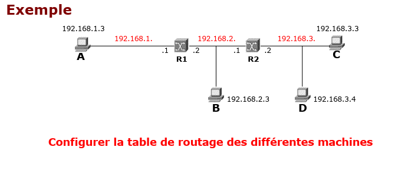
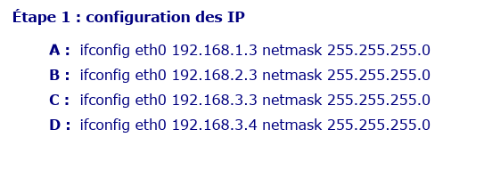

## Routage dynamique(Protocoles RIP,OSPF,EGP,BGP)
### mise a jour de la table de routage 
- Manuelle "routage statique"
    - table de routage entree manuellement par l administrateur 
    - commande "route" des stations unix 
    - langage de commande des routeurs(ip route ...)
- Automatique "dynamique" 
    - table de routage mis a jour dynamiquement par le routeur 
    - processus sur les stations et les routeurs 
    - echanges d'informations de routage : protocoles de routage 
        - routage base sur un vecteru de distance 
        - routage base sur l etat des liens 

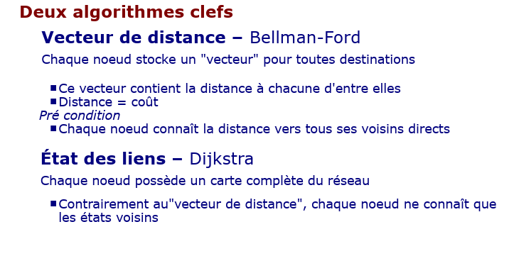

### type de routeurs : 
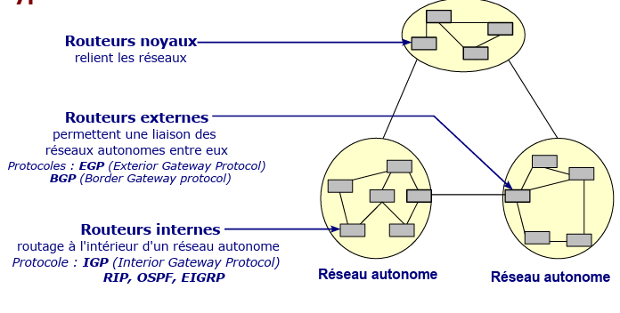

### RIP : Routing information protocol 
- avantages : 
    - tres utilise et tres repondu sur tous les equipements 
    - s'adapte automatiquement (panne, ajout de reseau ... )
- Inconvenients : 
    - la distance ne tientt pas compte de l'etat de la liaison (la charge,debit,couts des lignes ... )
    - distance maximale = 15(ne peut pas aller plus de 15 routeurs)
    -traffic important(toutes les 30s un message)
    - pas d'authentification des messages(ataques de routeurs en generant des faux messages RIP)
 
note : protocoles tres efficace dans un petit reseau que l'on controle mais pas adapte aux grands domains 
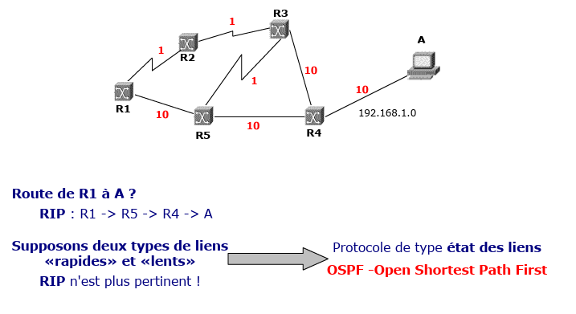

### OSPF - Open shortest path first 
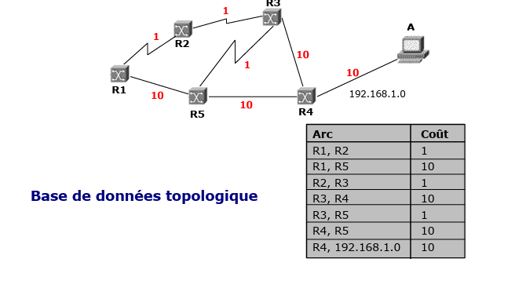

# to add more here 

# couche transport 

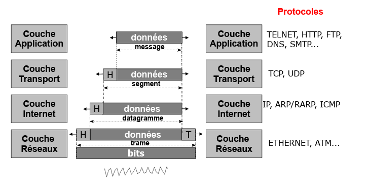

### services et protocoles de la couche : 
    - cree un circuit de communication logique entre des applications s'executant sur des hotes distants 
    - Les protocoles de la couche transport ne s'executent qu'au extremites 
### services transport vs reseau 
    - couche reseau : transfert de donneees entre machines 
    - couche transport : transfert de donnees entre applications 
        - se fonde sur les services de la couche reseau et les ameliore 
 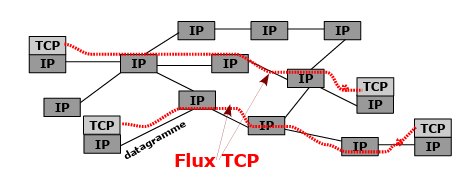

 ### services de transport : 
- livrason fiable (TCP) : 
    - reception des segments dans l'ordre 
    - controle de congestion 
    - controle de flot 
    - mise en place de connection 
- livraison non fiable - UDP 
    - sans garantie d'ordre 
    - peut s'etendre au multicast 

- services non disponibles 
    - temps reel, garantie de delai 
    - garantie de bande passante 
    - multicast fiable 
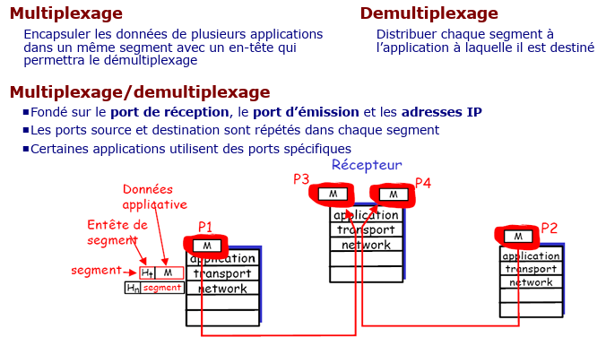
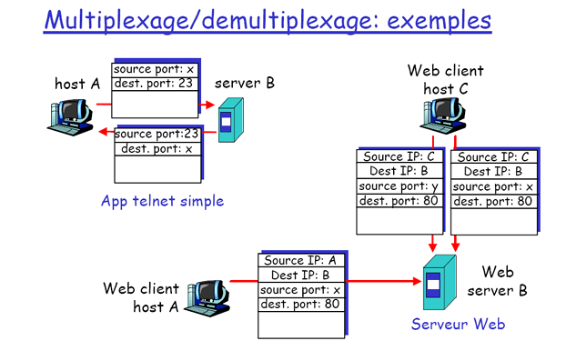
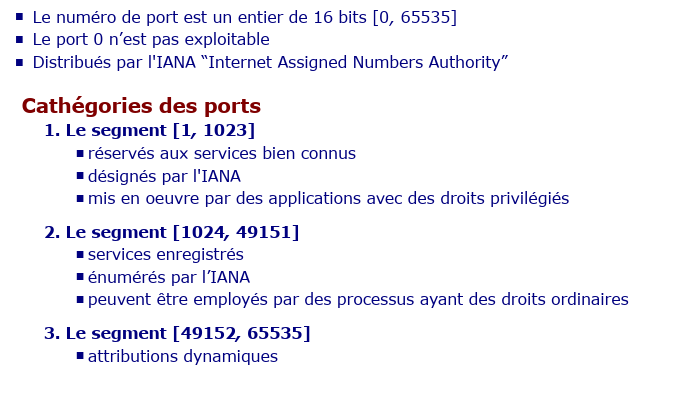
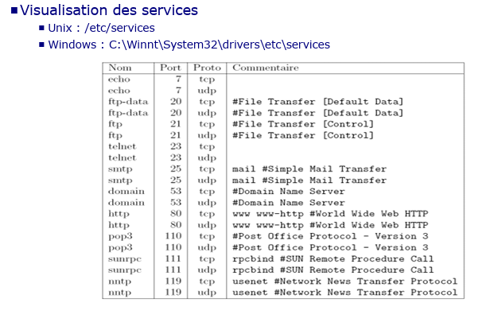

# couche transport - PROTOCOLE UDP 

- UDP : User Datagram Protocol 
Pourquoi UDP : sans delai de connexion - simple donc plus rapide - petit en-tete 
- souvent utilise pour les apps multimedias (streaming multimedia) : tolerance aux pertes - sensible au debit 
- autre utilisation : DNS , SNMP 
- Transfert fiable sur UDP : ajouter des mecanismes de compensation de pertes a niveau applicatif - compensation de pertes adaptee a chaque application. 
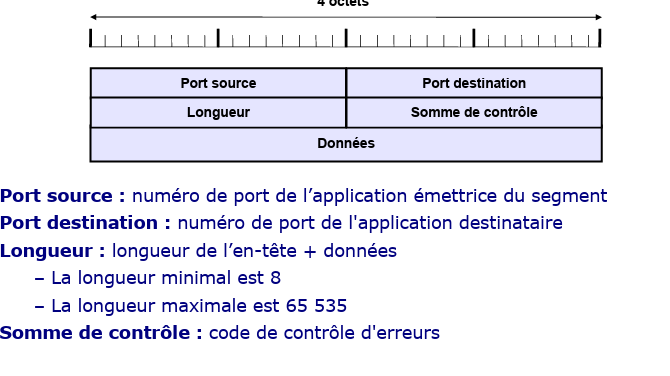

# Couche de transport - Protocole TCP 
- Transport control protocol 
### caracteristiques : 
- arrivee garantie des donnees 
- recuperation des erreurs par reemission 
- Re assemblage des donnees dans le bon ordre 
- verification du flot de donnees afing d'eviter une saturation du  reseau 
- multiplexage/demultiplexage des donnees 
- initialisation et fin d'une communication 
- communication en mode connecte 
    - ouverture d'un canal 
    - Communication Full-duplux 
    - Fermeture du canal 
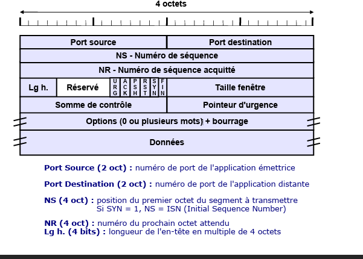
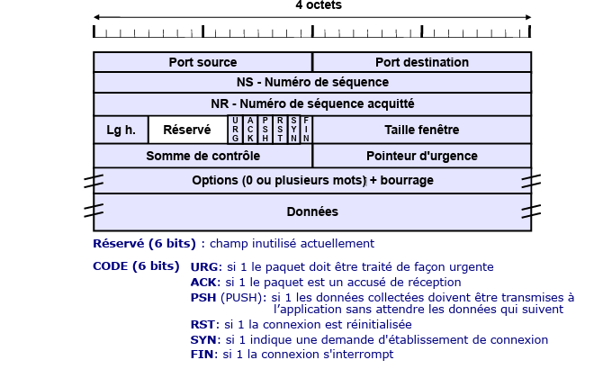
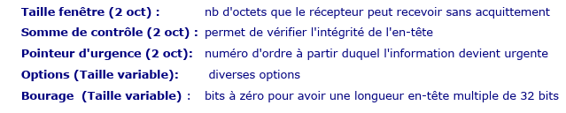
### fiabilite des transferts : 
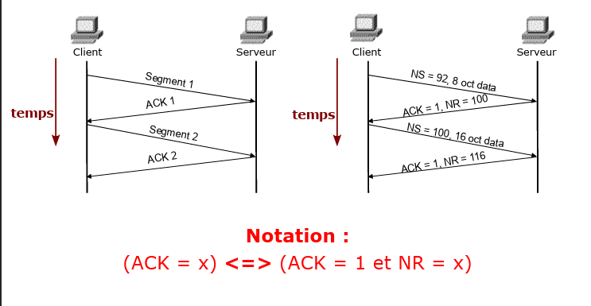
- Les pertes de segment sont detectees par absence d'ack positif a expiration d'un temporisateur sur l'emetteur 
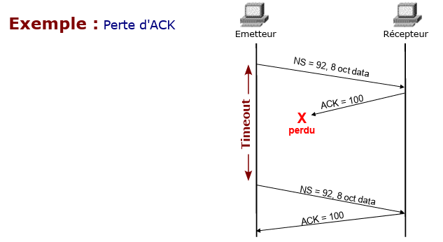
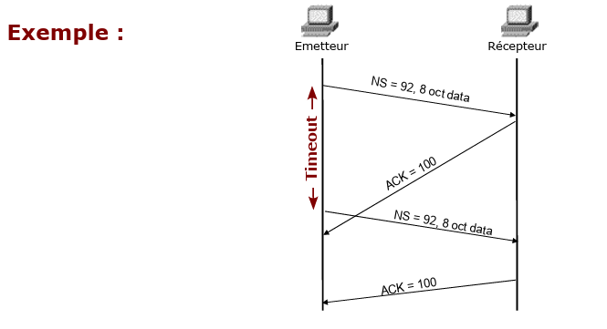
### Etablissement de connexion 
- schema de connexion 
    - Ports TCP doivent etre ouverts 
    - application sur le serveur a l'ecoute (en attente d'une connexion)
    - Application sur le client fait une requete de connexion 

- Les paquets pour ouvrir la connexion 
    1. Client : demande de connexion 
    2. serveur : acceptation de connection 
    3. client : accuse de reception ACK=y+1,SYN=0