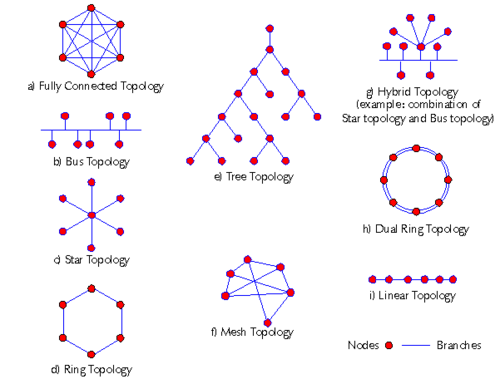

# RESEAU PREPARATIONS 

# Introduction et fondamentaux de Reseaux :
## 1.1. Definitions et concepts de base : 

### Qu'est un reseau information : 

* **Réseau** : ensemble d’entités ou de nœuds interconnectés afin de permettre des échanges ou des interactions entre eux.

* **Réseau informatique** : ensemble de dispositifs informatiques (ordinateurs, serveurs, smartphones, imprimantes, etc.) interconnectés par des moyens de communication, permettant d’échanger des données et de partager des ressources.

### Topologies physiques et logiques (Etoile,Bus,Anneau,Maille) : 

- topologie physique : decrit la maniere dontt les equipements d'un reseau sont physiquement connectes entre eux(cables,commutateurs,etc..) 
- topologie logique : decrit la maniere dont les donnees circulent entre les equipements du reseau,independamment de leur position physique.
 

***Principales topologies** : 
- Etoile  : tous les equipements sont relies a un equipement central, generalement un switch ou un hub 
- Bus : tous les equipements sont connectes a un meme cable principal, appele bus, qui sert de support de transmission partage 
- Anneau: chaque equipement est connecte a deux equipements voisins, formant une boucle fermee dans laquelle les donnees circulent 
- maillee(mesh) : les equipements sont relie entre eux par plusieurs liaisons, offrant plusieurs chemins possibles pour transmettre les donnees. 

### Typologies selon la couverture geographique : 
- PAN (Personal area network) : reseau de tres courte portee, generalement autour d'une personne, permetant de connecter des appareils personnels 
- LAN (Local Area Network) : reseau couvrant une zone geographique limitee, comme une maison un bureau un laboratoire ou un batiment. 
- MAN(Metropolitan Area Network) : reseau couvrantt une zone geographique plus etendue qu'un LAN, generalement a l'echelle d'une ville ou d'une agglomeration. 
- WAN(Wide Area Network) : reseau couvrant une tres grande zone geographique,pouvant relier des reseaux situes dans differentes villes, regions ou pays 
### Modes de transmission : Simplex, Half-Duplex, Full-Duplex. 
- Simplex : La transmission des donnees se fait dans un seul sens. Un equipement emet et l'autre recoit, sans possibilite de reponse sur le meme canal. 
- Half-Duplex : la transmission peut se faire dans les deux sens mais pas simultanement. Les equipements doivent alterner entre emission et reception 
- Full Duplex : la transmission peut se faire dans les deux sens simultanement. Les deux equipements peuvent emettre et recevoir en meme temps
### Modes de diffusion : Unicast, Broadcast, Multicast, Anycast. 
- Unicast : un emetteur envoie des donnees a un seul destinataire 
- Broadcast : un emetteur envoie des donnees a tous les equipements du reseau local 
- Multicast : un emetteur envoie des donnees a un groupe specifique de destinataires qui ont rejoint le groupe multicast 
- Anycast : un emetteur envoie des donnees a un seul destinataire parmi plusieurs equipements partageant la meme adresse Anycast, generalement celui qui est considere comme le plus proche selon le protocole de routage.
 
 ## 1.2 Architecture et materiels d'interconnexion : 
### Équipements de couche 1 : Répéteur, Hub (Concentrateur).
les equipements de couche 1 (physique) du modele OSI agissent principalement sur la transmission des signaux electriques, optiques ou radio, sans analuser les adresses reseau ou les trames. 
- Repeteur(Repeater) : equipement qui regenere et retransmet un signal afin d'augmenter la distance de transmission et de compenser son affaiblissement. Il ne filtre pas les donnees et ne prend pas de decision sur leur destination 
- Hub(Concentrateur) : equipement qui recoit un signal sur un portt et le repere sur tous les autres ports. Tous les equioements connectes partagent donc le meme domaine de collision. Le hub fonctionne au niveau physique(couche 1). 

### Équipements de couche 2 : Commutateur (Switch), Pont (Bridge).
Les equipements de couche 2(liaison de donnees) du modele OSI utilisent principalement les adresses MAC pour acheminer les trames au sein d'un reseau local. 
- commutateur (Switch) : equipement qui recoit les trames et les transmet uniquement vers le port correspondant au destinataire, en utilisant sa table d'adresses MAC, Il permet de reduire les collisions et de segmenter le reseau
- Pont(Bridges) : equipement qui relie deux segments de reseau et filtre les trames en fonction des adresses MAC. Il permet de determiner si une trame doit etre transferee d'un segmentt a l'autre. 

### Équipements de couche 3 : Routeur, Switch Niveau 3.
les equipements de couche 3 (reseau) du modele OSI utilisent principalement les adresses IP pour acheminer les paquets entre differents reseaux.
- Routeur : equipement qui relie plusieurs reseaux differents et achemine les paquets IP vers leur reseau de destination. Il utilise une table de routage pour determiner le meilleur chemin. 
- Switch de niveau 3(layer 3 switch) : commutateur capable d'effectuer des fonctions de routage IP, en plus de ses fonctions classiques de commutation de couche 2. Il permet notamment permettre la communication entre differents VLANs.

### Notions de Domaine de collision et Domaine de diffusion (Broadcast). 

- Domaine de collision (Collision Domain) : partie d'un reseau dans laquelle plusieurs equipements peuvent emettre des donnees simultanement, ce qui peut provoquer une collision lorsque le reseau utilise un mecanisme de partage du support comme l'Ethernet half-duplex.
    - Hub : tous les ports appartiennet au meme domaine de collision
    - switch : chaque port constitue generalementt un domaine de collision distinct 

- Domaine de diffusion(Broadcast domain) : ensemble des equipements qui recoivent une trame de broadcast envoyee sur le reseau 
    - Hub/Switch : un broadcast est generalement transmis a tous les equipements du meme reseau local/VLAN
    - routeur: separe les domaines de broadcast et ne transmet generalement pas les broadcasts d'un reseau IP a un autre. 
- A retenir : 
    - Hub - meme domaine de collision 
    - Switch - separe les domaines de collision  
    - Routeur - separe les domaines de broadcast 

# 2. Les Modèles d'Architecture (OSI et TCP/IP) 
## 2.1. Le modèle théorique OSI (7 couches)
### 2.1.1. Couche 1 : Physique (Bits, signaux, câblage) : 

la couche physique est la premiere couche d modele OSI. Elle assure la transmission des bits(0 et 1) sous forme de signaux a travers un support de communication 
- unite de donnees : bit 
- role : transmettre les bits d'un equipement a un autre 
- elements concernes : signaux electriques, optiques ou radio,cables,connecteurs,frequences et niveaux de signal. 
- exemples de supports : cable ethernet,fibre optique, ondes radio 
- equipements associes: repeteur  et hub 

  
A retenir : la couche physique s'occupe de la maniere dont les bits sont transmis, mais ne s'occupe pas de leur signification ni de leur destination 

### 2.1.2. Couche 2 : Liaison de données (Trames, adresses MAC). 
La couche liaison de donnees assure la communication entre deux equipements directement connectes su un meme reseau. Elle organise les bits recus de la couche physique en trames et utilise les adresses MAC pour identifier les equipements
- Unite de donnees : trames(frames) 
- Role : assurer une transmission fiable des trames entre equipements directement connectes et controler l'acces au support de transmission
- adressage : adresse MAC
- fonctions principales : 
    - encapsulation des donees en trames
    - identification des equipements avec les adresses MAC
    - detection des erreurs de transmission
    - controle de l'acces au support 
- equipements associes : switch(commutateur) et bridge(pont) 

- a retenit : la couche 2 s'occupe principalement de la communication locale entre equipements en utilisant les trames et les adresses MAC

###  2.1.3. Couche 3 : Réseau (Paquets, adresses IP, routage).
la couche reseau assure l'acheminement des donnees entre differents reseaux. Elle utilise les adresses IP pour identifier les reseaux et les equipements, puis determine le chemin que les paquets doivent suivre jusqu'a leur destination. 
- unite de donnees: paquet 
- role : acheminer les paquets d'un reseau source vers un reseau de destination 
- adressage : adresse IP(IPv4 ou IPv6) 
- fonctions principales : 
    - attribution et utilisation des adresses IP 
    - Routage des paquets entre differents reseaux 
    - Determination du chemin vers la destination
    - transmission des paquets d'un routeur a un autre
- Equipement principal : routeur(Router) 

- A retenir : la couche 3 s'occupe principalement de l'adressage IP et du routage des paquets entre les reseaux. 

###  2.1.4. Couche 4 : Transport

La **couche transport** assure la communication **de bout en bout entre les applications** exécutées sur deux équipements. Elle contrôle la transmission des données et peut assurer leur fiabilité selon le protocole utilisé.

* **Unité de données :** segment pour **TCP** ; datagramme pour **UDP**.

* **Rôle :** assurer la transmission des données entre les applications source et destination.

* **Adressage :** **numéros de port**, qui permettent d’identifier les applications ou services.

* **Principales fonctions :**

  * **Segmentation** des données et réassemblage à la destination.
  * Identification des applications grâce aux **ports**.
  * **Contrôle de flux** pour éviter qu’un émetteur n’envoie des données plus rapidement que le récepteur ne peut les traiter.
  * **Contrôle des erreurs et retransmission** avec TCP.
  * Gestion de la connexion avec TCP ; UDP fonctionne sans connexion.

* **Protocoles principaux :** **TCP** et **UDP**.

**À retenir :** la couche 4 s’occupe de la communication **entre les applications**, en utilisant notamment les **ports**, la segmentation et le contrôle de la transmission.

### 2.1.5. Couche 5 : Session

La **couche session** assure l’**établissement, la gestion et la terminaison des sessions de communication** entre deux applications. Elle permet de maintenir et de contrôler le dialogue pendant l’échange de données.

* **Rôle :** gérer les sessions de communication entre les applications.
* **Fonctions principales :**

  * **Établissement** d’une session.
  * **Maintien et gestion** du dialogue entre les applications.
  * **Synchronisation** des échanges de données.
  * **Terminaison** de la session.
  * Possibilité de définir des **points de reprise** en cas d’interruption.

**À retenir :** la couche 5 s’occupe de **la gestion du dialogue entre les applications**, du début jusqu’à la fin de la session.

### 2.1.6. Couche 6 : Présentation

La **couche présentation** assure la représentation et la transformation des données afin que les applications puissent les comprendre et les échanger dans un format compatible.

* **Rôle :** assurer la compatibilité des formats de données entre les applications.
* **Fonctions principales :**

  * **Formatage et conversion** des données entre différents formats.
  * **Chiffrement et déchiffrement** des données.
  * **Compression et décompression** des données.
  * Gestion de la représentation des caractères, par exemple ASCII et Unicode.

**À retenir :** la couche 6 s’occupe de la **représentation, du chiffrement et de la compression des données** pour permettre leur échange entre les applications.

### 2.1.7. Couche 7 : Application

La **couche application** est la couche la plus proche de l’utilisateur. Elle fournit aux applications les **services réseau** nécessaires pour communiquer avec d’autres applications ou systèmes.

* **Rôle :** fournir des services réseau directement utilisés par les applications.
* **Fonctions principales :**

  * Permettre aux applications d’accéder aux **services réseau**.
  * Gérer les échanges entre les applications et les services du réseau.
  * Fournir des protocoles adaptés aux différents besoins de communication.
* **Exemples de protocoles :**

  * **HTTP / HTTPS** : navigation Web.
  * **DNS** : résolution des noms de domaine.
  * **FTP** : transfert de fichiers.
  * **SMTP** : envoi d’e-mails.
  * **SSH** : accès distant sécurisé.

**À retenir :** la couche 7 fournit les **services réseau utilisés par les applications**, comme le Web, le DNS, le transfert de fichiers ou la messagerie.

## 2.2. Le modèle pratique TCP/IP (4 ou 5 couches)

### 2.2.1. Couche Accès Réseau

La **couche Accès Réseau** est la couche la plus basse du modèle TCP/IP. Elle regroupe les fonctions des **couches Physique et Liaison de données du modèle OSI**. Elle permet la transmission des données sur le réseau local en utilisant les supports et technologies d’accès au réseau.

* **Correspondance OSI :** couches **1 (Physique) + 2 (Liaison de données)**.
* **Unité de données :** trame au niveau liaison, puis **bits** au niveau physique.
* **Rôle :** assurer la transmission des données sur le **support physique** et leur acheminement sur le réseau local.
* **Fonctions principales :**

  * Transmission des **bits** sous forme de signaux.
  * Encapsulation des données en **trames**.
  * Utilisation des **adresses MAC**.
  * Contrôle de l’accès au support de transmission.
  * Détection de certaines erreurs de transmission.
* **Exemples de technologies :** Ethernet, Wi-Fi.
* **Équipements associés :** switch, hub, répéteur, carte réseau.

**À retenir :** la couche Accès Réseau regroupe les fonctions des couches **1 et 2 du modèle OSI** et permet aux données de circuler sur le **réseau local et le support physique**.

### 2.2.2. Couche Internet

La **couche Internet** du modèle TCP/IP assure l’**adressage logique** et l’**acheminement des paquets entre différents réseaux**. Elle correspond principalement à la **couche Réseau (couche 3) du modèle OSI**.

* **Correspondance OSI :** couche **3 (Réseau)**.
* **Unité de données :** **paquet (Packet)**.
* **Rôle :** permettre aux paquets de circuler d’un réseau source vers un réseau de destination.
* **Adressage :** **adresses IP** (IPv4 ou IPv6).
* **Fonctions principales :**

  * Attribution et utilisation des **adresses IP**.
  * **Routage** des paquets entre les réseaux.
  * Détermination du chemin vers la destination.
  * Transmission des paquets entre les différents routeurs.
* **Protocoles principaux :** **IP (IPv4/IPv6), ICMP**.

**À retenir :** la couche Internet s’occupe principalement de **l’adressage IP et du routage des paquets entre les réseaux**.

### 2.2.3. Couche Transport

La **couche Transport** assure la communication **de bout en bout entre les applications** exécutées sur deux équipements. Elle contrôle la transmission des données et utilise les **numéros de port** pour identifier les applications concernées.

* **Correspondance OSI :** couche **4 (Transport)**.
* **Unité de données :** **segment** pour TCP ; **datagramme** pour UDP.
* **Rôle :** assurer la communication entre les applications source et destination.
* **Adressage :** **numéros de port**.
* **Fonctions principales :**

  * **Segmentation** et réassemblage des données.
  * Identification des applications grâce aux **ports**.
  * **Contrôle de flux**.
  * **Contrôle des erreurs et retransmission** avec TCP.
  * Gestion d’une communication **avec connexion (TCP)** ou **sans connexion (UDP)**.
* **Protocoles principaux :** **TCP** et **UDP**.

**À retenir :** la couche Transport assure la communication **de bout en bout entre les applications**, notamment grâce aux **ports, à la segmentation et au contrôle de la transmission**.

### 2.2.4. Couche Application

La **couche Application** est la couche la plus proche de l’utilisateur dans le modèle TCP/IP. Elle regroupe les fonctions des **couches Session, Présentation et Application du modèle OSI** et fournit les services réseau directement utilisés par les applications.

* **Correspondance OSI :** couches **5 (Session) + 6 (Présentation) + 7 (Application)**.
* **Rôle :** fournir aux applications les **services et protocoles nécessaires à la communication sur le réseau**.
* **Fonctions principales :**

  * Établissement et gestion des échanges entre les applications.
  * **Formatage, chiffrement et compression** des données selon les protocoles utilisés.
  * Accès aux différents **services réseau**.
* **Protocoles principaux :**

  * **HTTP / HTTPS** : communication Web.
  * **DNS** : résolution des noms de domaine.
  * **FTP** : transfert de fichiers.
  * **SMTP** : envoi d’e-mails.
  * **SSH** : accès distant sécurisé.

**À retenir :** la couche Application regroupe les fonctions des **couches 5, 6 et 7 du modèle OSI** et fournit les **services réseau directement utilisés par les applications**.
## 2.3. Mécanisme fondamental : Encapsulation et Désencapsulation

L’**encapsulation** est le processus par lequel chaque couche du modèle réseau **ajoute ses propres informations de contrôle**, généralement sous forme d’**en-tête (header)**, aux données reçues de la couche supérieure.

La **désencapsulation** est le processus inverse : à la réception, chaque couche **analyse puis retire les informations qui lui sont destinées** avant de transmettre les données à la couche supérieure.

### Encapsulation

Lorsqu’une application envoie des données, celles-ci descendent à travers les couches du modèle :

**Donnée → Segment → Paquet → Trame → Bits**

* **Couche Application :** données.
* **Couche Transport :** ajout de l’en-tête TCP ou UDP → **segment** (TCP) / **datagramme** (UDP).
* **Couche Réseau :** ajout de l’en-tête IP → **paquet**.
* **Couche Liaison :** ajout d’un en-tête et généralement d’une remorque (*trailer*) → **trame**.
* **Couche Physique :** transformation de la trame en **bits** transmis sous forme de signaux.

### Désencapsulation

À la réception, le processus s’effectue dans le sens inverse :

**Bits → Trame → Paquet → Segment → Donnée**

Chaque couche traite les informations qui lui sont destinées, puis transmet le contenu restant à la couche supérieure.

**À retenir :**

> **Encapsulation :** on ajoute des informations en descendant les couches.
> **Désencapsulation :** on retire ces informations en remontant les couches.

**PDU (Protocol Data Unit)** désigne l’unité de données traitée par une couche donnée :

* **Application → Données**
* **Transport → Segment / Datagramme**
* **Réseau → Paquet**
* **Liaison → Trame**
* **Physique → Bits**
